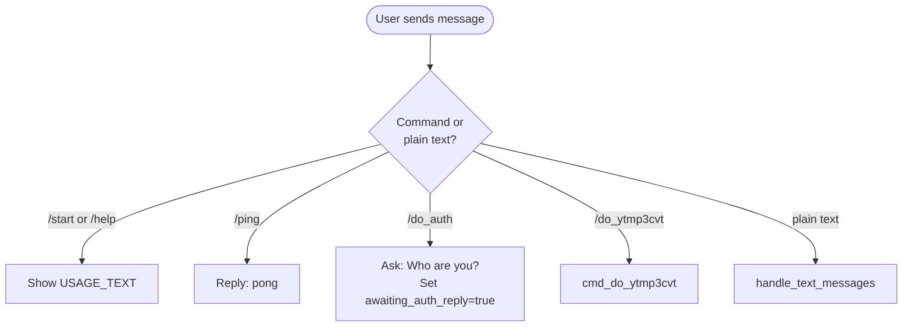
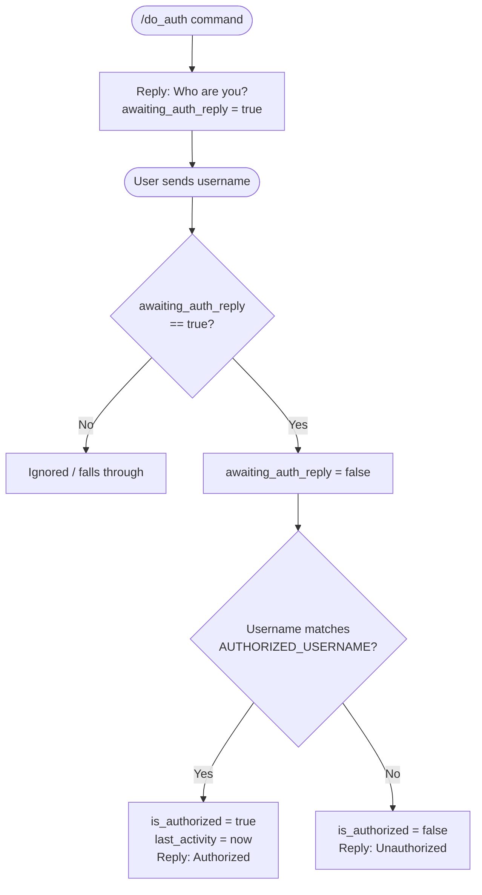
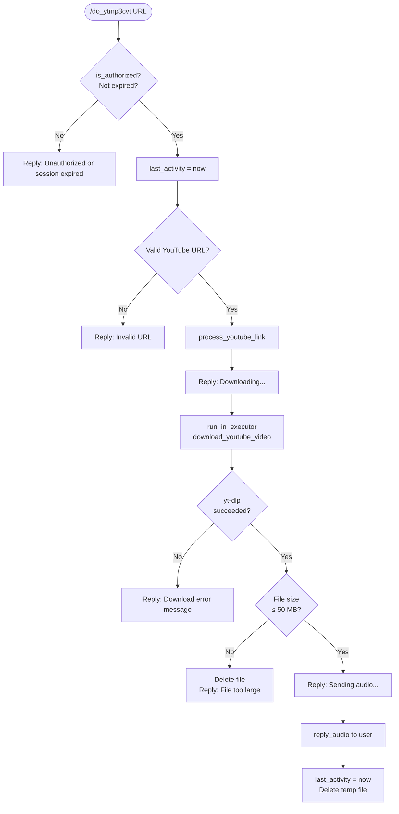
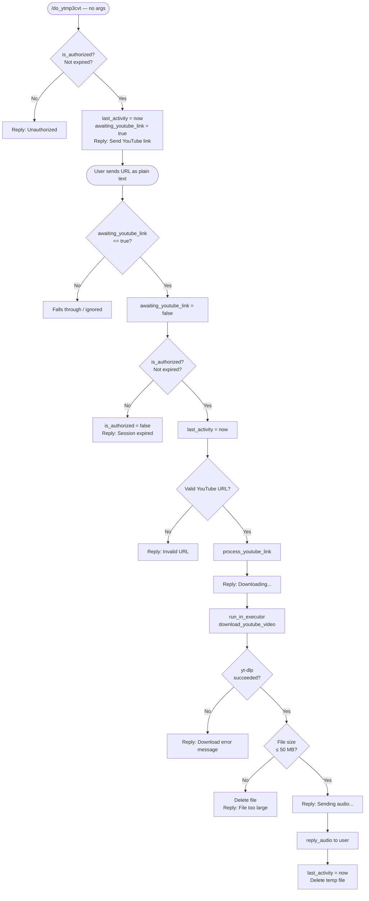
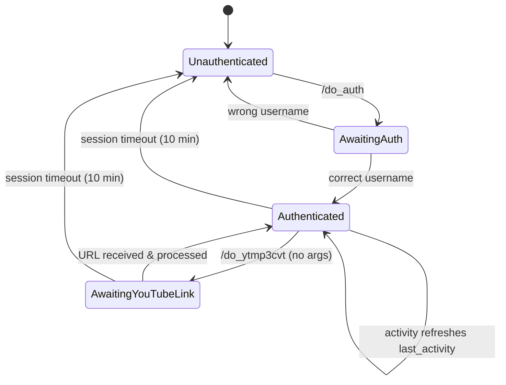

# RomDynamics Bot — Workflows

## 1. Overall Bot Command Flow

---

## 2. Authentication Flow

---

## 3. YouTube MP3 Download Flow — via Command Args

---

## 4. YouTube MP3 Download Flow — via Awaiting Link

---

## 5. Session Lifecycle

